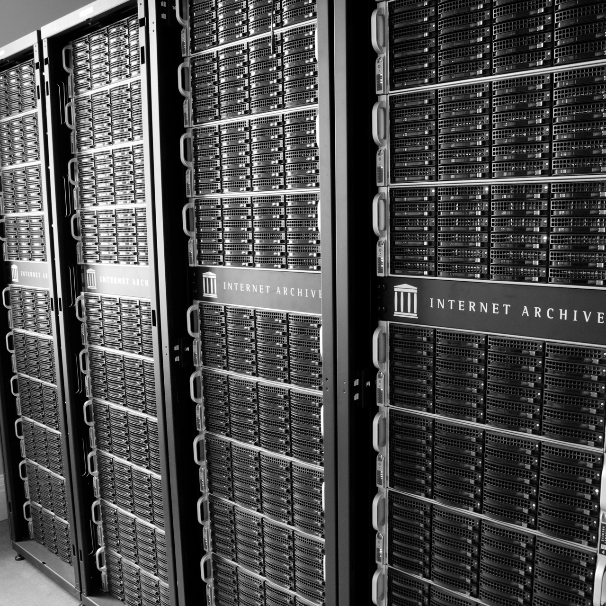

# Big Data 

* 3.5 million books
* 170+ billion web pages
* More than 6 Petabytes of data

----

# Items #
* Fundamental unit of storage. 
* The archive is basically a large collection of items (10 million+).
* A directory tree consisting of
    * Original files
    * Derivatives
    * XML Metadata
* Each item is stored on two servers for redundancy.

----

# Item example #

.fx: notitle

    <h3><a href="http://archive.org/details/HollywoodWithoutMakeup">http://archive.org/details/HollywoodWithoutMakeup</a></h3>
    

----

# Item example #

.fx: notitle

    <h3><a href="http://archive.org/details/HollywoodWithoutMakeup">http://archive.org/details/HollywoodWithoutMakeup</a></h3>
    

----
# Collections #

* `Collections` are groups of items.
* Used for classification.

----

# Collection example #

.fx: notitle

    <h3><a href="http://archive.org/details/netlabels">http://archive.org/details/netlabels</a></h3>
    

----

# Hardware #
* The [petabox](http://archive.org/web/petabox.php) - Designed originally to hold 1 petabyte of data.
* Custom built by the Archive.
* Low power : 6KW per rack, 
* High density : 650+ TB per rack
* No air conditioning
* Fits in a shipping container. 
* Currently 4 data centres - 1300 nodes, 11000 spinning disks

---- 

# Petabox 1 #

.fx: notitle

    <h3>The first gen petabox</h3>

----

# Petabox 2 #

.fx: notitle

    <h3>The current racks</h3>

----

# Petabox 3 #

.fx: notitle

    <h3>The racks in the great room</h3> 
        <a href="http://www.flickr.com/photos/mirka23/6300272115/">http://www.flickr.com/photos/mirka23/6300272115/</a>
    

----

# Shipping container #

.fx: notitle

    <h3>How big is the internet?</h3> 
        <a href="http://www.computerwoche.de/bild-zoom/1891307/1/489893/EL_12381492082557490680957/">http://www.computerwoche.de/bild-zoom/1891307/1/489893/EL_12381492082557490680957/</a>
    

----

# Main services

* The site functions using three main pieces
    * The locator
    * The catalog
    * The deriver

----

# Locator service #
* UDP packet sent out when a file needs to be downloaded.
* Server that holds that item responds.
* HTTP redirect to that server.
* Allows any number of storage nodes without much infrastructure change.

-----
# Catalog #
* Offline task queue.
* Heart of the archives data processing operations.
* Time consuming modifications to data are done via. catalog tasks.
* Old fashioned message queue. Has tombstones from over half a decade ago.

----
# Deriver #
* Uploaded items are rsynced to a `worker`.
* Deriver taks run on them that create new files out of the originals. 
     * e.g. `ogg`, `mp3` out of `FLAC` files. 
     * OCR uploaded book scans to get the text out.
* New files created, metadata updated and item rsynced back to primary.
* Originals unmodified. Derivatives often more useful.
* Derivation is a catalog task.
----

# Software stack #
* PHP, Nginx, Solr, MySQL, Redis, solr and a pinch of Python and Java for the apps.
* KVM for virtualisation.
* Nagios, graphite, MRTG, cacti

----

# What makes the Archive different?

-----
# Where would you store your data? #

.fx: notitle

    <h3>Where would you store your valuable data?</h3>

----

# How would you store your data? #

.fx: notitle

    <h3>How would you store your valuable data?</h3>

----

# The Approach

* Long term preservation
* Simplicity. Battle tested technologies.
* Independence and self-sufficiency.
* Low maintenance.
* Low cost.
* *"Code dies, data lives on".*

----

# Thanks!

.fx: center

## See us at the Internet Archive stall on the first floor.

http://archive.org/
