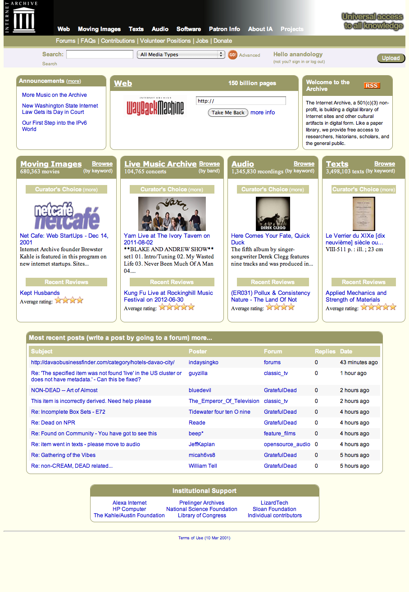

# How Internet Archive Preserves Petabytes of Data

.fx: title-slide middle notitle

# How Internet Archive Preserves Petabytes of Data
 

    Fifth Elephant
     
    July 27, 2012

 
 
 
 

    <a class="author" href="http://openlibrary.org/anand">Anand Chitipothu</a> 
    & <a class="author" href="http://openlibrary.org/noufal">Noufal Ibrahim</a>
     
     
    <a src="http://www.archive.org/">Internet Archive</a>

----

# Internet Archive

.fx: notitle

---

# Universal Access to All Knowledge

---

# Internet Archive

.fx: notitle

---

# Internet Archive

.fx: notitle

    <h3>www.archive.org</h3>

---

# The Way Back Machine

.fx: notitle bottom-title

