# How Internet Archive Preserves Petabytes of Data

.fx: title-slide middle notitle

# How Internet Archive Preserves Petabytes of Data
 

    Fifth Elephant
     
    July 27, 2012

 
 
 
 

    <a class="author" href="http://openlibrary.org/anand">Anand Chitipothu</a> 
    & <a class="author" href="http://openlibrary.org/noufal">Noufal Ibrahim</a>
     
     
    <a src="http://www.archive.org/">Internet Archive</a>

----

# Internet Archive

.fx: notitle

---

# Universal Access to All Knowledge

---

# Internet Archive

.fx: notitle

---

# Internet Archive

.fx: notitle

    <h3>www.archive.org</h3>

---

# The Way Back Machine

.fx: notitle bottom-title

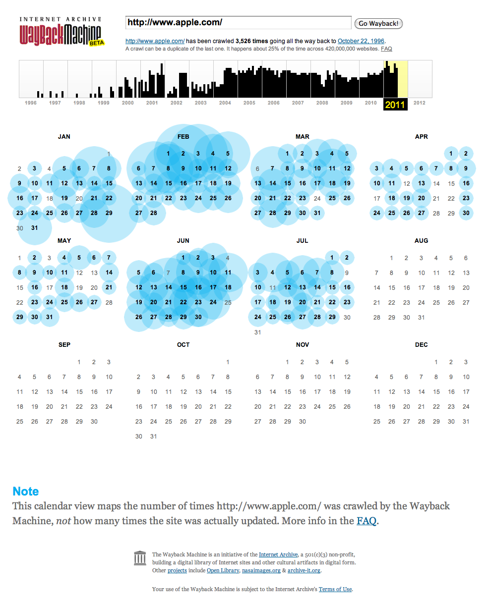

---
## www.apple.com - 1996

.fx: notitle

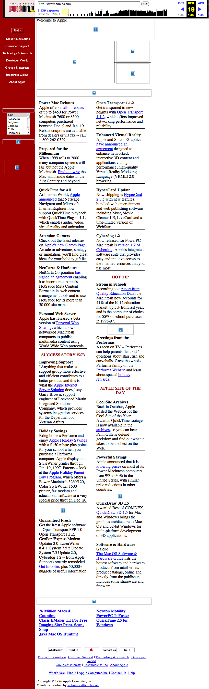

---
## www.apple.com - 1997

.fx: notitle

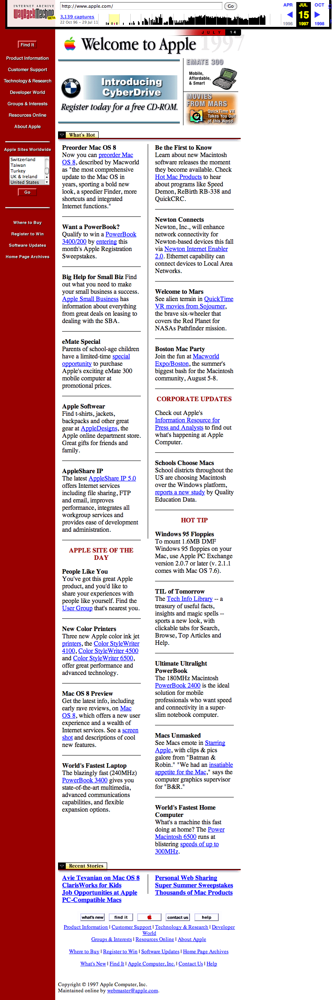

---
## www.apple.com - 1998

.fx: notitle

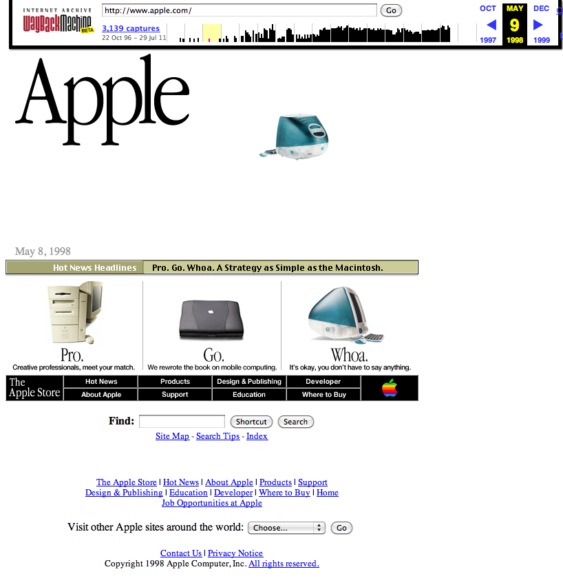

---
## www.apple.com - 1999

.fx: notitle

---
## www.apple.com - 2000

.fx: notitle

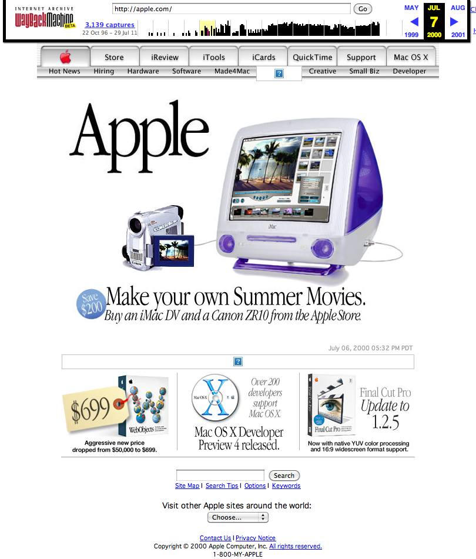

---
## www.apple.com - 2001

.fx: notitle

---
## www.apple.com - 2002

.fx: notitle

---
## www.apple.com - 2003

.fx: notitle

---
## www.apple.com - 2004

.fx: notitle

---
## www.apple.com - 2005

.fx: notitle

---
## www.apple.com - 2006

.fx: notitle

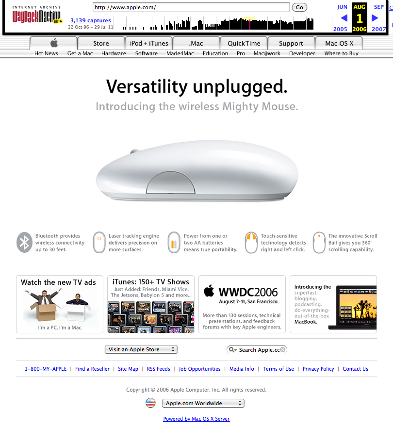

---
## www.apple.com - 2007

.fx: notitle

---
## www.apple.com - 2008

.fx: notitle

---
## www.apple.com - 2009

.fx: notitle

---
## www.apple.com - 2010

.fx: notitle

---
## www.apple.com - 2011

.fx: notitle

---

# Archive It!

.fx: notitle bottom-title

---

# IA Scanning Center At San Francisco

.fx: notitle bottom-title

---

# IA Scanning Centers World Wide

.fx: notitle bottom-title

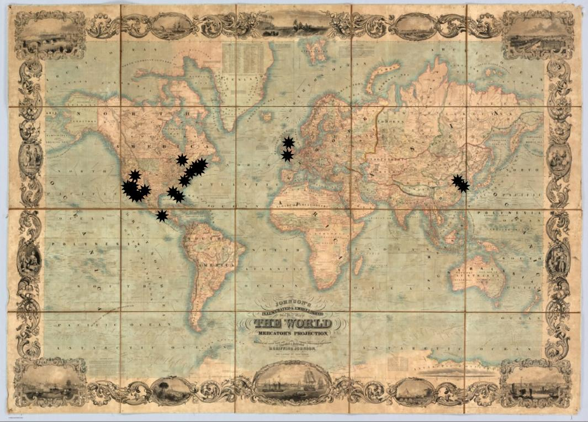

---

# Sample Book

.fx: notitle

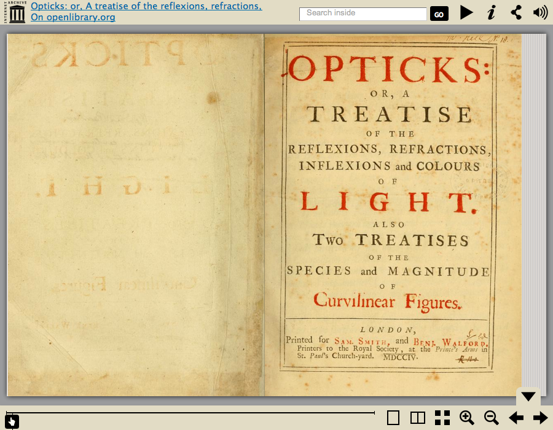

---

# Fulltext Search

.fx: notitle

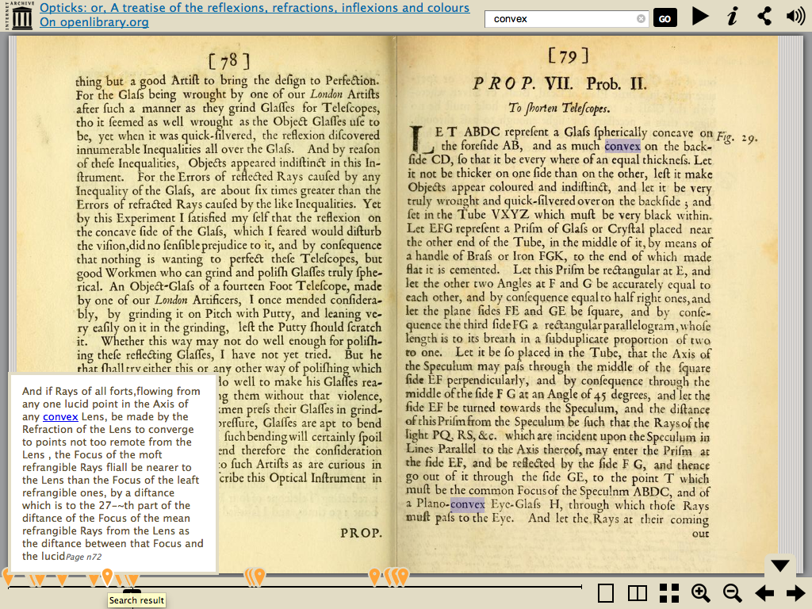

---

# Table of Contents

.fx: notitle

---

# IA Book Reader

The book reader can be embedded in any web page. 

<iframe src='http://www.archive.org/stream/opticksortreatisnewt?ui=embed#mode/2up' width='100%' height='70%' frameborder='0' >
</iframe>

---
# Newton's Notes

     
    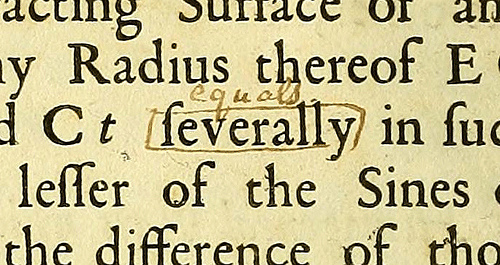

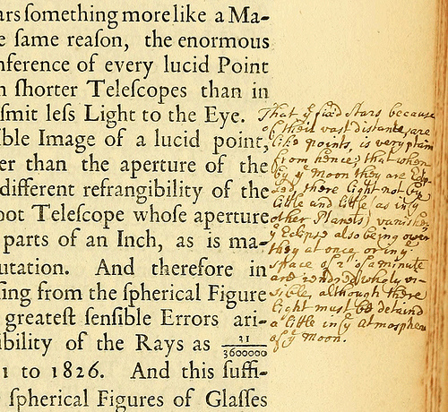

